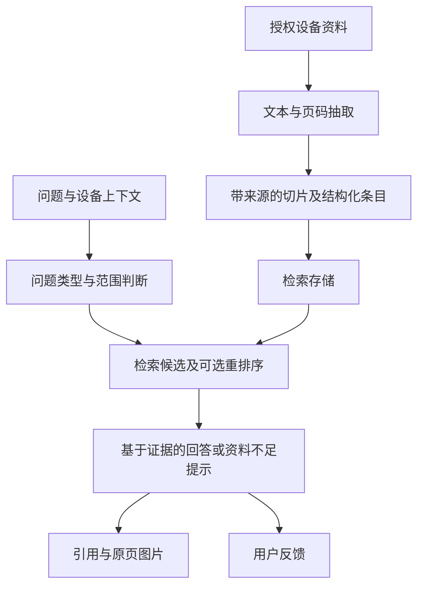

# 设备手册 AI 问答 · 从检索证据到原页预览

[← 作品集首页](../PORTFOLIO.md) · [企业系统维护](enterprise-systems.md) · [软著材料边界](software-rights.md)

> 企业 AI 应用，核查了私有仓库中的 Python 服务、跨端接口说明、部署适配及验证记录。本文不公开设备手册、内部规则参数、生产配置或调用日志。

## 业务问题与本人工作

设备资料查询需要找到与设备、型号和问题对应的内容，并能够回查原文和图示。我的工作包括借助 Codex 开发问答应用、接入百炼 / DeepSeek API，以及实现回答、引用、原文和图片展示。

进一步核查仓库后，可以确认它不止是把问题直接发给模型：服务包含资料抽取、带页码的切片、检索、可选重排序、基于证据生成、原页预览和用户反馈。以下区分代码存在、历史验证记录与正式生产使用。

## 系统模块与数据流

*图为代码层面的脱敏概括，不表示所有分支都经过生产验收，也不展示雇主实际部署拓扑。*

| 技术 | 实际可核实用途 |
| --- | --- |
| Python / FastAPI | 文档处理、检索及问答服务，提供统一 JSON 接口 |
| 百炼 / DeepSeek | 可配置的 embedding、重排序或生成适配；具体启用组合依运行配置而定 |
| PostgreSQL / pgvector | 标准模式的资料与向量检索 |
| SQLite / Python | Windows 轻量模式，保存切片和向量，由 Python 对候选计算相似度 |
| Flutter 客户端 | 问答、来源预览及反馈交互；客户端通过服务接口访问 |
| Docker Compose、PowerShell、uvicorn | 分别支持容器方案和 Windows 原生启动、入库流程 |

## 关键实现与取舍

**先确认问题范围，再检索。**  
服务代码按问题类别和设备上下文选择处理路径；资料不足或问题超出范围时有独立返回类型。故障条目可以优先走结构化查询，其他问题检索文档片段。这里是规则与检索编排，不是自主操作设备的 Agent。

**引用需要能够定位原页。**  
切片保留来源和页码信息，预览按来源标识找到文件；PDF 根据对应页渲染图片。代码也包含图片直接预览和 Office 转 PDF 路径。Office 路径当前显示转换文档首页，不能因此承诺所有格式都已实现精确页级定位。

**证据不足不能只靠模型补全。**  
回答构建包含资料不足、范围外和上下文不足等分支；可选生成建立在检索结果之上。分支存在并不证明所有回答都正确，也不意味着已经获得临床或维修安全认证。

**部署要适配可用环境。**  
2026-07-29 技术记录说明，既有 Windows 环境无法直接使用需要虚拟化的容器方案，因此增加 SQLite 本地存储模式，保持客户端接口一致，并保留 PostgreSQL / pgvector 路径。轻量模式先过滤候选，再在 Python 中计算相似度；它的性能和并发边界需要实测，文档建议容量不能当作已达到的负载。

## 验证证据与未完成范围

| 证据 | 可以说明什么 | 不能说明什么 |
| --- | --- | --- |
| 服务代码及接口文档 | 检索、重排序/生成适配、来源预览与反馈路径存在 | 所有 provider 已在生产稳定运行 |
| 早期本地 MVP 记录 | 资料抽取与检索已有验证过程，也记录了部分文件无法抽取 | 任意扫描件或全部手册均可正确解析 |
| Windows 适配验证记录 | 语法检查、SQLite 建库及小批资料入库/检索完成过本地验证 | 实际语义模型效果、高并发或全量生产可靠性 |
| 部署与验收手册 | 有健康检查、问答、来源预览、反馈和真机网络检查步骤 | 这些步骤已全部在正式环境执行通过 |

Windows 记录的本地入库验证使用 hash embedding；不能把它当作真实百炼语义向量评测。本次作品集整理未重跑模型或内部资料测试，也没有新的生产上线证明。

## 使用价值与后续改进

应用把回答和原始资料回查放在同一流程中，让使用者有机会对照来源，而不必只相信生成文本。它展示的是实际检索实现和 API 应用集成；不宣称自研大模型、完成生产级 Agent、达到已证实的答案准确率或覆盖全部设备型号。

进一步完善应补充受控问答评测、真实 provider 配置下的效果、正式环境权限与访问验证，以及业务使用记录。企业源码和手册保持私有，软著申请材料与登记证据分开处理。
