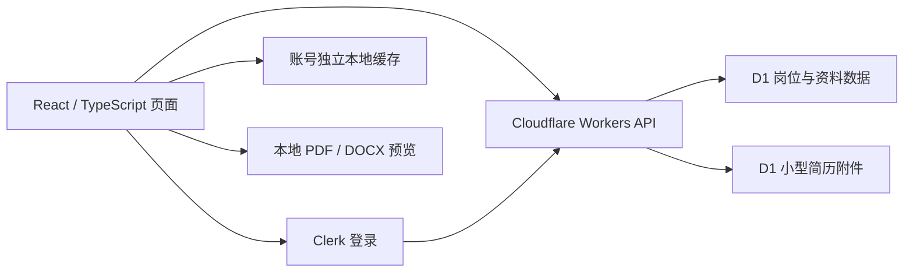

# OfferPath · 求职流程管理与资料交付

[← 作品集首页](../PORTFOLIO.md) · [在线产品](https://offerpath.xingo.fun)

> 个人闭源产品。依据：最新远端依赖与 README、本地实现只读核查，以及 2026-09-17 至 09-19 交付记录。本次没有部署应用或修改开发中的工作目录。

## 业务问题与我的职责

求职信息分散在招聘网站、表格和文件夹中，岗位阶段、面试安排、下一步行动与投递简历容易脱节。我独立开发 OfferPath，把这些信息组织为围绕岗位持续更新的工作流。

我的工作覆盖产品流程、前后端实现、数据与登录集成、部署及问题修复；使用 Codex / ChatGPT 辅助实现，但保留人工审阅、真实流程检查与发布责任。

## 需求如何变成模块

| 需求 | 产品实现 | 需要处理的边界 |
| --- | --- | --- |
| 信息集中管理 | 岗位录入、CSV/XLSX 导入、状态与活动历史、搜索导出 | 重复检测、导入错误和已有记录保护 |
| 持续跟进 | 下一步、面试/测评日程、日历文件与邮件提醒实现 | 时间、阶段变化与提醒优先级 |
| 跨设备使用 | Clerk 登录、本地账号缓存、Workers API、D1 同步 | 账号隔离、离线写入、删除冲突 |
| 找到投过的简历 | 岗位附件上传、替换、移除、站内预览及下载 | 文件权限、容量、版本冲突与失败恢复 |
| 针对岗位整理经历 | 资料库、JD、草稿对照、编辑确认与 Word 导出 | 事实来源、人工确认、长度限制及模型状态 |

## 技术栈与架构

*图为当前核心数据流示意，未将实验中的简历引擎画为生产依赖。*

React / TypeScript 组织界面和数据类型，Vite 提供构建；Workers 同时提供静态资源与 API，D1 保存云端数据，Clerk 提供登录。开发与交付工具包括 pnpm、ESLint、TypeScript、Wrangler、Playwright 及项目脚本。这里的可核实取舍，是在已有架构上扩展功能，避免为小型附件额外引入付费存储。

## 深入一项交付：简历附件

用户需求从“保存对应简历”进一步明确为“先在站内预览，再决定下载”，同时要求不新增收费服务。最终使用 D1 BLOB 保存受限大小的 PDF / DOCX，与记录元数据同事务更新；容量限制由数据库触发器控制。

服务端按认证用户与岗位共同查询附件；修改要求版本匹配，其他页面已更新时返回冲突，避免旧页面覆盖新文件。上传同时检查扩展名、类型、基本文件头和实际流入字节数。它是基础格式与容量校验，不等于完整恶意文件扫描。

预览区分格式：PDF.js 按需加载、在浏览器逐页显示 PDF；DOCX 提供文字预览。文件不因预览而发送到第三方解析服务；DOCX 文字预览不等于忠实复现 Word 排版。

## 交付中遇到的问题

生产迁移曾因 SQL 触发器解析失败而回滚，随后部署步骤又在迁移未完成时触发，造成短暂切换风险。交付记录说明已回滚应用，调整触发器写法后重新迁移和部署。这一经历说明数据库迁移与应用发布必须有明确的先后和失败中止条件；不能把发布描述成一次无故障成功。

附件交付记录还包含真实文件的存储字节校验与刷新后保留验证。公开案例只描述验证方法，不公开文件内容、岗位记录或生产数据库备份。

## AI 简历与 Resume Matcher 的最新边界

| 状态 | 已核实内容 |
| --- | --- |
| 已有上线记录 | 2026-09-19 的自建资料与简历 MVP：资料库、岗位选择、草稿编辑确认、保存、Word 导出 |
| 已有代码及模拟验证 | 百炼请求结构、事实编号约束、账号所有权、冲突、未配置服务提示及限流 |
| 本地独立实验 | Resume Matcher 固定版本审计、提取无状态保留模块、DOCX/PDF 文本提取、模拟生成与 Word 导出 |
| 尚未完成验证 | 真实百炼调用与生成质量、Resume Matcher 正式接入线上、商业多用户负载与持久费用账本 |

Resume Matcher POC 实际复用的是上游的保留规则模块，保留其 Apache 2.0 许可证和来源。上游参考：[srbhr/Resume-Matcher 固定版本](https://github.com/srbhr/Resume-Matcher/tree/ab2b370d1fb98d9272f71b8d6e54a9c51ac75110)。源码审计发现上游共享实例不能直接当作 OfferPath 的多租户权限边界，因此先保留 OfferPath 的账号与数据所有权控制，在独立实验中验证可复用部分。

实验还发现上游规则可能保留新增技能，外层适配增加了恢复原技能集合的约束。这是具体的事实保护问题；事实编号校验仍不能证明语义绝无虚构，人工审阅必须存在。

## 验证与效果

既有附件记录包括类型检查、lint、build、Worker/D1 隔离与并发测试、失败回滚、本地浏览器预览及真实存储字节核对。资料与简历记录包括模拟模型契约验证；Resume Matcher POC 审计记载 14 项 Python 测试、浏览器模拟流程和中英文 Word 样例渲染。**这些是历史验收记录，本次文档整理没有重新运行它们。**

产品已用于本人真实求职记录管理，附件有实际保存证据。没有依据声称已经规模化获客、获得收入或验证付费转化。现有资料也记录跨设备删除恢复、邮件提醒优先级等仍需继续处理的事项；不能因 README 写有同步机制就视为所有边界问题已经解决。

## 如何体验与继续讨论

用虚构岗位建立记录，修改阶段和下一步，刷新后查看，再导入/导出测试数据。附件演示使用无隐私样例，分别检查预览、下载和替换。AI 生成状态以产品提示为准，不把按钮存在当作模型已启用。

源码保持私有，公开网站用于产品体验。后续重点是更完整的同步冲突验证、简历独立版本、真实模型质量与费用验证，以及不同 Word 环境的导出版式检查。
