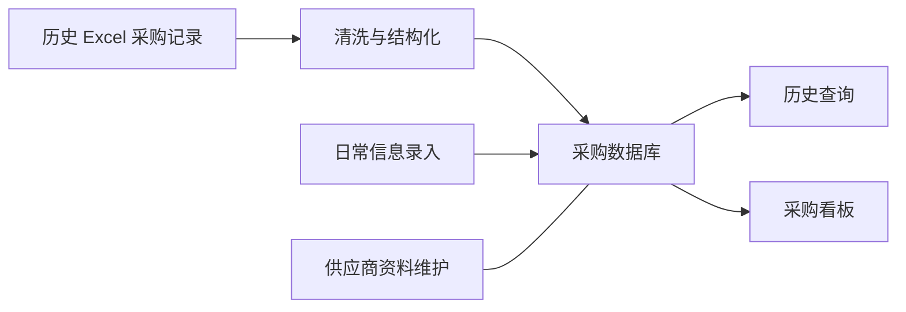

# 智采 · 把分散采购记录变成部门使用的工具

[← 作品集首页](../PORTFOLIO.md) · [相关：链析](lianxi.md) · [企业系统维护](enterprise-systems.md)

> 企业项目，脱敏工作案例。依据：本人工作背景、GitHub 中的既有项目记录；未取得可公开的内部源码、验收单或运行截图。

## 业务问题与需求

采购历史记录分散在多份 Excel 中，查询和复用依赖逐份表格查找。工作不只是把旧表搬进数据库，还要让业务人员能继续录入信息、维护供应商资料，并通过统一界面查看已有采购记录。

我主导开发内部采购工具，处理历史数据清洗与结构化建库，并围绕实际采购工作实现查询、录入、仪表盘和供应商管理。已有材料明确平台由采购部门使用；没有材料支持采购金额、用户人数或节约比例。

## 从数据整理到业务模块

下图是已知业务链路的概括示意，不包含真实字段、供应商或采购金额。

| 模块 | 要解决的具体问题 | 已知实现范围 |
| --- | --- | --- |
| 历史数据清洗与建库 | 旧记录分散，难以重复使用 | 整理历史 Excel，建立结构化采购数据库 |
| 历史查询 | 需要从旧记录中找到可参考信息 | 在统一工具中查询采购历史 |
| 信息录入 | 系统需承接后续日常使用 | 业务人员补充、维护采购信息 |
| 仪表盘 | 需要在查询之外集中查看信息 | 已实现看板；指标定义不在当前公开材料中 |
| 供应商管理 | 供应商资料需持续维护 | 已实现相关模块；不披露真实供应商明细 |

这组模块反映的需求取舍是：既处理存量数据，也给新增信息一个持续维护的入口。不能仅靠一次导入完成采购信息的长期管理。当前材料未确认审批流、订单结算或 ERP 对接，因此不将它们列入范围。

## 本人职责、技术与协作边界

可确认的本人贡献是主导工具开发、历史数据整理建库及上述业务模块实现。项目技术可确认到 Excel 数据处理、结构化数据库和业务应用层；前后端语言、框架、数据库产品、开发工具与部署环境尚未核实，不从个人项目技术栈推断企业实现。

业务使用部门是采购部门。需求由谁最终批准、是否有外包协作者及其代码责任，还没有足够记录可以公开划分，因此不把整个企业系统表述为本人独立完成。

## 交付、验证与实际使用

已有工作材料记载采购部门实际使用工具查询历史记录、补充信息及维护供应商资料。这证明系统进入了业务使用环节，但不能替代正式验收记录。当前未拿到脱敏测试样例、测试日期、数据对账结果或部署日志；本页不声称测试覆盖率或无故障时长。

维护的重点与业务流程直接相关：历史数据和新录入信息需要共同服务查询，供应商信息需要持续维护。具体故障修复案例、权限设计、备份与升级流程仍需补充原始证据后再展开。

## 结果与后续可补强的证据

已交付的价值是让采购部门在统一工具中查询、录入和维护信息，降低对分散表格的依赖。没有量化材料时，以实际使用范围描述结果。

下一步最有价值的补充是：一条脱敏需求如何变成功能、一组清洗前后虚构数据示例、一段实际验收过程，以及一次上线后的改动记录。它们比未经核实的“效率提升百分比”更能说明交付质量。

源码、真实采购报价与供应商资料不公开。项目名称用于描述本人工作经历，不表示本人拥有企业软件著作权。[软著记录与归属边界](software-rights.md)。
